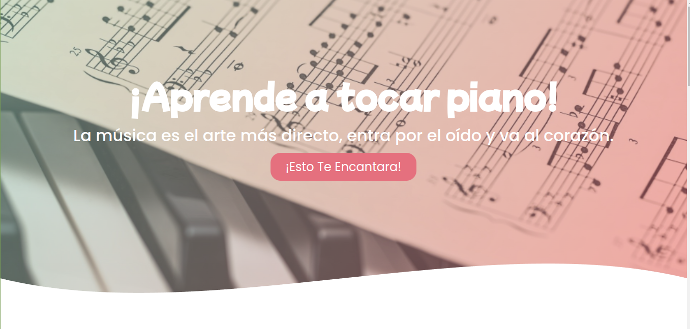
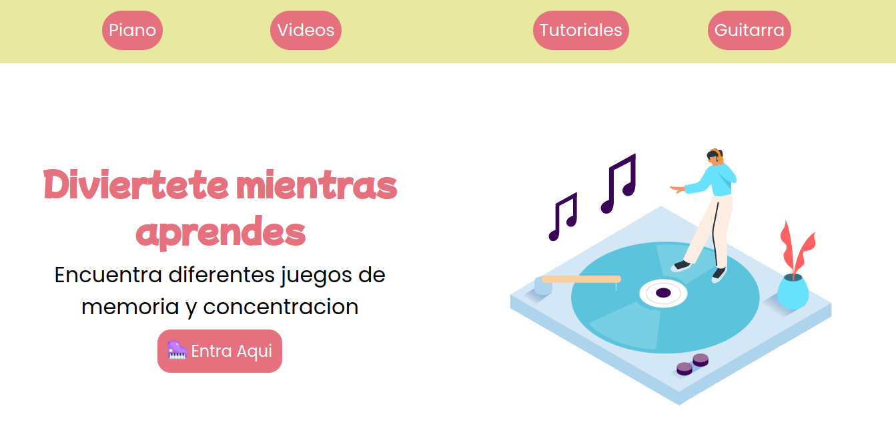
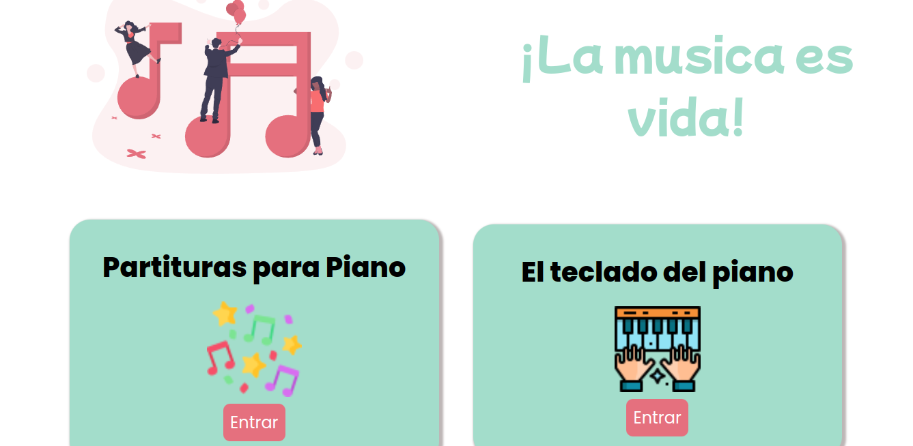

# toquen-el-DOM

---

  🔎 Toquen el DOM🔎 

- Andres Esteban Patino
  19.01.2022

Trabajaremos en crear una web para una una escuela de música online, con el plus de que los usuarios van a poder practicar con algunos de los instrumentos porque estos van a reproducir sonidos con click o con pulsaciones de teclado. La Escuela de música quiere ver las ofertas de diferentes duplas de desarrolladores para ver con cuál decide  quedarse.

https://www.sessiontown.com/es
https://dmauro.github.io/Keypress/

Contexto del proyecto
La tecnología ha permitido que se puedan migrar a la virtualidad muchas de las actividades que eran estrictamente presenciales, entre esas la educación, y en este caso puntual, las escuelas de música.

Desarrolla una web para la escuela de música "Toquen el DOM", en la que los usuarios pueden acceder al instrumento de su preferencia y practicar en él de forma didáctica. El diseño de la web queda a su criterio, aunque cabe aclarar que en los requerimientos de la escuela está la creatividad como punto importante a tener en cuenta.

​

Requerimientos técnicos ⚙️

​

El proyecto DEBE implementar metodología SCRUM.
El proyecto tendrá un sprint de 6 días hábiles.
Se DEBE planear el sprint en un product backlog.
Se DEBE utilizar GitFlow.
La página DEBE tener un diseño agradable, alusivo a la educación y a la múscia y responsive.
Los break points son:
​

/* Small (sm) */ @media (min-width: 640px) { /\* ... \*/ }

/* Medium (md) */ @media (min-width: 768px) { /\* ... \*/ }

/* Large (lg) */ @media (min-width: 1024px) { /\* ... \*/ }

/* Extra Large (xl) */ @media (min-width: 1280px) { /\* ... \*/ }

La página debe tener un instrumento a elegir entre piano, batería, y la marimba.
El diseño del instrumento es de libre elección, se pueden diseñar los componentes aparte o utilizar recursos externos, si se utilizan recursos externos deben ser gratis, no se permite el plagio.
Los sonidos deben corresponder (En el caso del piano y la marimba las notas deben estar en el orden correcto, los mismo con las partes de la batería).
El instrumento se DEBE poder tocar con el mouse.
El instrumento se DEBE poder tocar con el teclado.
se DEBE poder tocar de manera repetida y cuantas veces quiera el usuario.
El sonido de una parte del instrumento DEBE poder sonar a la par con las demás partes (Teclas para el piano, barras para la marimba y platillos, bombo, redoblante, etc para la batería).
Cuando se toque un elemento del instrumento DEBE mostrar algún movimento ( Ya sea Vibración, movimiento, o el efecto de que se oprime en el caso de las teclas)
El código DEBE ser ordenado, identado, semántico y con buenas prácticas de desarrollo: clean code.
La distribución del contenido DEBERÍA hacerse con Flex-box o Grid system.
No se pueden utilizar frameworks ni librerías, el desarrollo debe ser vanilla.
Extras ⚙️

La página DEBE tener un navbar con otros instrumentos que pueden consultar los usuarios.
La página DEBE tener documentación de los primeros pasos para tocar los instrumentos.
La página DEBE tener videos tutoriales de cómo tocar un instrumento.
La página DEBE tener video tutoriales de canciones sencillas con notas en de cada instrumento para tocar en vivo.
​

Fuentes a consultar https://www.w3schools.com/w3css/w3css_templates.asp

https://www.codeseek.co/preview/womJzx

https://www.youtube.com/watch?v=iS1vCsF_pNY

https://www.codeseek.co/preview/KgWxyq

https://www.w3.org/Style/Examples/011/firstcss.es.html

https://www.thebeatles.com/explore?type=story_album

https://developer.mozilla.org/es/docs/Web/CSS/CSS_Grid_Layout

https://developer.mozilla.org/es/docs/Web/CSS/CSS_Flexible_Box_Layout/Basic_Concepts_of_Flexbox

https://css-tricks.com/snippets/css/a-guide-to-flexbox/

​

https://www.w3schools.com/js/

​

https://developer.mozilla.org/es/docs/Web/JavaScript

Modalidades pedagógicas
El desarrollo será en duplas, con posibilidad de consultar inquietudes con los compañeros.
Se evaluará la manera en que se organiza el product backlog.
Se evaluará la forma de dividir las tareas.
​

Criterios de rendimiento
El resultado final debe mostrar una interfaz agradable y cómoda a la vista con una buena experiencia de usuario, también debe tener sonidos en buena calidad.

Modalidades de evaluación
Wheel of doom para escoger cinco proyectos al azar y hacer code review.
Revisión y retro individual.

Entregables
- Enlace del Product backlog. Máximo hasta el jueves 20 de enero a las 11:59 pm.
- Mockups del proyecto en formato escritorio y móvil. Máximo hasta el viernes 21 de enero a las 11:59 pm.
- Enlace del respositorio de GitHub con un MVP (Producto mínimo viable). Máximo el lunes 24 de enero a las 11:59 pm.
- Enlace del repositorio en Github con un Readme que explique lo que se ha desarrollado. Máximo hasta miércoles 26 de enero a las 2 pm.
- Enlace del deploy en Github pages. Máximo hasta el miércoles 26 de enero hasta las 11:59 pm.

---

## PROJECT TOQUEN EL DOM

---

  

---

  

---

  

---

  

---

1) Elaboramos una pagina web con enfoque infantil, para aprender piano.

2) creamos las siguientes paginas:
inicio, piano virtual, videos, tutoriales.

3) añadimos a nuestra pagina diferentes enlaces referentes al piano, como: juegos, partituras, notas musicales, y guia de las teclas del piano.

4) En la pagina del piano virtual, es un piano funcional que lo pueden usar tanto con las teclas como con el mouse, igualmente tiene sus instrucciones.

5) cada pagina tiene su menu. 

6) Es una pagina web responsive.

7) manejamos dos tipos de tipografia:
   Mochiy Pop P One para los titulos y poppins para los textos.

8) manejamos una paleta de colores:

- salmon : #E5707E
- verde : #E5707E
- amarillo : #E8E9A1.

___

**coders github** 👨‍💻 :octocat:
___

- 👨‍💻 **[Dario Higuera Moreno]( https://github.com/dariohimo)**
___

- 👨‍💻 **[Daniela Puerta]( https://github.com/daniela8896)**

___

## deploy 

---

**github pages** 📜

- **[github Pages](https://daniela8896.github.io/toquen-el-DOM/)**
---

**Repo github** :octocat:

- **[Repo_GITHUB]( https://github.com/daniela8896/toquen-el-DOM)**

---